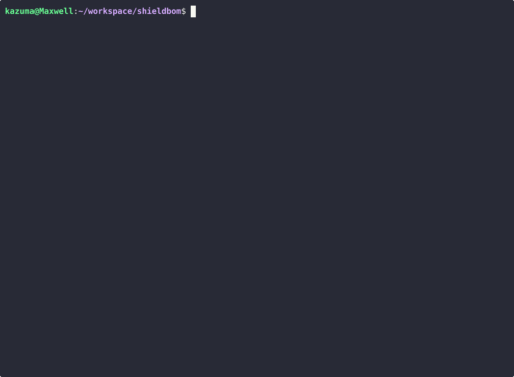

# ShieldBOM

**SBOM vulnerability scanner and license checker for embedded/IoT software.**

[](https://github.com/kazumaxwell1117/shieldbom/actions)
[](https://crates.io/crates/shieldbom)
[](LICENSE)

---

<p align="center">
  
</p>

ShieldBOM parses SBOM files (SPDX, CycloneDX), matches components against known vulnerabilities, and detects license conflicts -- all from a single binary that works offline. Built for embedded and IoT teams who deal with C/C++ supply chains, cross-compiled dependencies, and air-gapped build environments.

## Features

- **SBOM parsing** -- SPDX 2.3 (JSON, Tag-Value) and CycloneDX 1.4/1.5 (JSON, XML)
- **Vulnerability matching** -- CPE-based lookup against NVD/OSV data with CVSS severity scoring
- **License conflict detection** -- Flags known-incompatible combinations (e.g., GPL-3.0 + proprietary)
- **Multiple output formats** -- Human-readable table, JSON, and SARIF 2.1.0
- **Offline-first** -- Download a vulnerability DB snapshot once, scan without network access
- **Single binary** -- No runtime dependencies; works on Linux, macOS, and Windows
- **Non-zero exit codes** -- Fails the build when policy violations are found (severity threshold configurable)

## Supported Formats

| Standard | Versions | File Types |
|----------|----------|------------|
| SPDX | 2.3 | `.spdx.json`, `.spdx` (Tag-Value) |
| CycloneDX | 1.4, 1.5 | `.cdx.json`, `.cdx.xml` |

## Quick Start

### Installation

```bash
cargo install shieldbom
```

Or build from source:

```bash
git clone https://github.com/kazumaxwell1117/shieldbom.git
cd shieldbom
cargo build --release
# Binary is at ./target/release/shieldbom
```

### First scan

```bash
# Scan any SPDX or CycloneDX file you already have
shieldbom scan your-product.spdx.json

# Or try the included examples (if you cloned the repo)
git clone https://github.com/kazumaxwell1117/shieldbom.git
shieldbom scan shieldbom/examples/smart-gateway-firmware.spdx.json
```

Example output (scanning a sample IoT gateway firmware SBOM):

```
$ shieldbom scan examples/smart-gateway-firmware.spdx.json

ShieldBOM Scan Results
File: examples/smart-gateway-firmware.spdx.json
Format: SPDX 2.3 (JSON)
Components: 9

  0 Critical  0 High  0 Medium  0 Low

License Issues
--------------------------------------------------------------------------------
  [Copyleft] busybox @ 1.36.0 - Copyleft license 'GPL-2.0-only' detected
             - may conflict with proprietary distribution
```

By default, ShieldBOM queries [OSV.dev](https://osv.dev/) for vulnerabilities. For offline/air-gapped environments:

```bash
shieldbom db update           # Download vulnerability DB (once)
shieldbom scan --offline product.spdx.json
```

## Usage

### `scan` -- Analyze an SBOM for vulnerabilities and license issues

```bash
# Basic scan (table output, severity >= medium)
shieldbom scan product.spdx.json

# JSON output for CI pipelines
shieldbom scan product.spdx.json --format json

# SARIF output for GitHub Code Scanning / IDE integration
shieldbom scan product.cdx.xml --format sarif > results.sarif

# Only fail on critical/high severity
shieldbom scan product.cdx.json --severity high

# Fully offline scan with a specific DB path
shieldbom scan product.spdx.json --offline --db /path/to/vuln.db
```

### `validate` -- Check SBOM format and completeness

```bash
shieldbom validate vendor-sbom.cdx.json
```

### `db` -- Manage the local vulnerability database

```bash
# Download or update the vulnerability database
shieldbom db update

# Show database status
shieldbom db info
```

### Exit codes

| Code | Meaning |
|------|---------|
| 0 | No issues found above the severity threshold |
| 1 | Vulnerabilities or license conflicts detected |
| 2 | Input error (malformed SBOM, missing file) |

## Output Formats

**Table** (default) -- Human-readable summary in the terminal with severity counts and affected components.

**JSON** (`--format json`) -- Structured report for downstream tooling and dashboards.

**SARIF** (`--format sarif`) -- SARIF 2.1.0 for integration with GitHub Code Scanning, VS Code, and other SARIF-compatible tools.

## Why ShieldBOM?

Existing SCA tools (FOSSA, Snyk, and enterprise platforms) are built for web applications and container ecosystems. If you work with embedded software, you already know the gaps:

- **C/C++ supply chains are invisible.** Package managers like Conan and vcpkg have limited SBOM support. Vendor-provided binaries ship with no metadata. These tools assume npm/pip/Maven dependency trees exist.
- **Air-gapped environments are common.** Factory build servers, automotive CI systems, and classified environments cannot phone home to a cloud API on every build.
- **$100K+/year licensing is not an option.** Enterprise SCA platforms with real embedded coverage price out small-to-mid-size teams. ShieldBOM's core functionality is free and open source.

ShieldBOM is built for this reality:

| | ShieldBOM (OSS) | Enterprise SCA | FOSSA / Snyk |
|---|---|---|---|
| SPDX + CycloneDX parsing | Yes | Yes | Partial |
| Offline operation | Yes | Limited | No |
| Single binary, no dependencies | Yes | No | No |
| Embedded/IoT focus | Yes | Yes (at $100K+/yr) | No |
| Price | Free | $100K+/year | $0-500/month |

### EU Cyber Resilience Act (CRA)

The [EU Cyber Resilience Act (Regulation 2024/2847)](https://eur-lex.europa.eu/eli/reg/2024/2847/oj/eng), enforceable by December 2027, requires manufacturers to identify and document vulnerabilities and components of products with digital elements, including by drawing up an SBOM (Annex I, Part II). ShieldBOM helps you get ahead of this requirement today. CRA-specific compliance reports are planned for Phase 3.

## Roadmap

| Phase | Focus | Status |
|-------|-------|--------|
| **Phase 1** | OSS CLI: SBOM parsing, vulnerability matching, license checks | **v0.1.0 released** |
| **Phase 2** | SaaS dashboard, CI/CD integration (GitHub Actions, GitLab CI) | Planned |
| **Phase 3** | Embedded specialization: binary SBOM, RTOS support, EU CRA reports | Planned |
| **Phase 4** | Platform: fuzzing integration, SARIF aggregation | Planned |

### Current limitations (Phase 1)

- No binary/firmware SBOM generation yet (Phase 3)
- License conflict rules are a built-in set; custom policies are not yet supported
- No web UI or team features (Phase 2)

## Contributing

Contributions are welcome. Here is how to get started:

```bash
git clone https://github.com/kazumaxwell1117/shieldbom.git
cd shieldbom
cargo build
cargo test
```

Before submitting a PR:

1. Run `cargo fmt` and `cargo clippy`
2. Add tests for new functionality
3. Keep commits focused -- one logical change per commit

If you are unsure whether a change fits the project direction, open an issue first to discuss.

## License

Licensed under the Apache License, Version 2.0. See [LICENSE](LICENSE) for details.

### Contribution

Unless you explicitly state otherwise, any contribution intentionally submitted for inclusion in this project by you, as defined in the Apache-2.0 license, shall be licensed under the same terms, without any additional terms or conditions.
